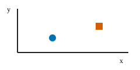

= Representative executable lesson
:stem: latexmath
:page-jupyter:
:jupyter-language-name: python
:jupyter-language-version: 3.12
:jupyter-kernel-name: python3
:jupyter-kernel-language: python

This fixture checks prose with inline mathematics stem:[\widehat\mu_n=n^{-1}\sum_{i=1}^n X_i].

.Definition: standard error
****
The standard error is the standard deviation of an estimator across repeated samples.
****

[NOTE]
====
The fixture is deterministic and performs no network access.
====

== Display mathematics

[stem]
++++
\operatorname{SE}(\widehat\mu_n)=\frac{\sigma}{\sqrt{n}}.
++++

== Ordered procedure

. Declare the population.
. Define the estimator.
. Quantify uncertainty.

== Contract table

|===
|Property |Value

|Language
|English

|Kernel
|Python 3
|===

Read xref:companion.adoc[the companion page].

== Python cells

[#deterministic-sample]
[source,python]
----
import numpy as np

rng = np.random.default_rng(42)
sample = rng.normal(size=8)
sample.mean()
----

[#checked-result]
[source,python]
----
assert sample.shape == (8,)  # <1>
print(f"mean={sample.mean():.6f}")
----
<1> The assertion is executable evidence, not only narrative.
